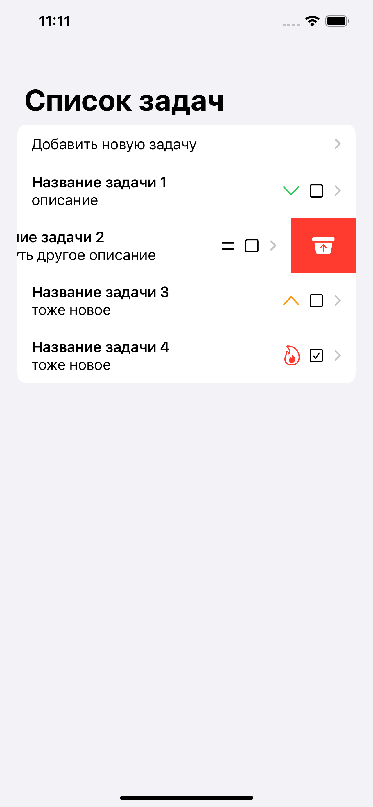
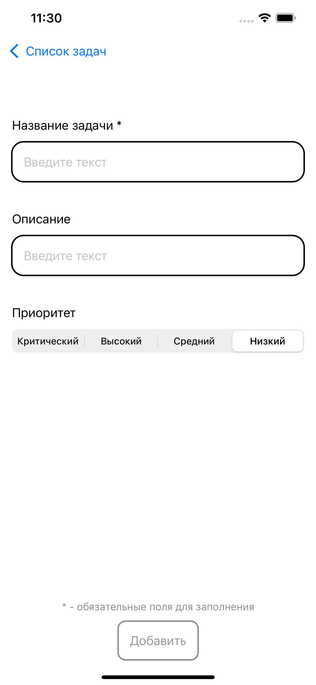
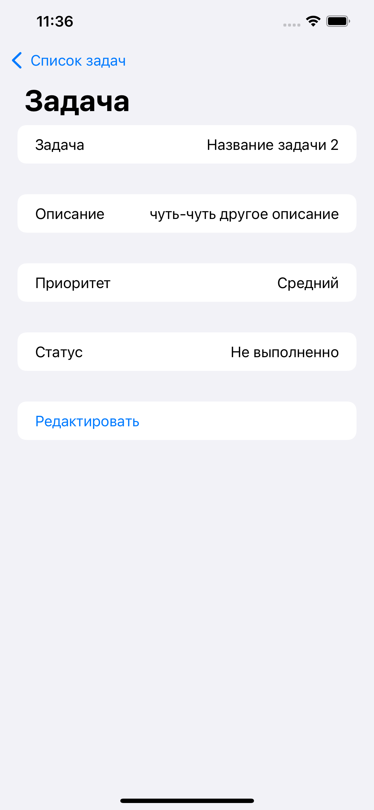
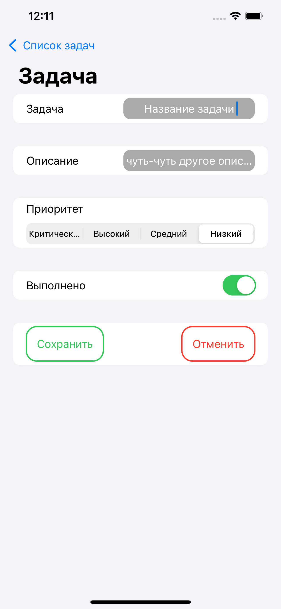

# Домашнее задание к занятию 1-2 "Архитектура MVVM с использованием SwiftUI. Переходы между экранами"

На лекции мы продолжили изучение SwiftUI, научились связывать потоки данных с представлениями, делать переходы между экранами с передачей данных а так же многое другое.
В ходе выполнения данного домашнего задания мы закрепим, а также углубим полученные знания по этим темам.

## Общие требования и рекомендации
1. Задачи следует хранить в userDefaults
2. Создание идентичного дизайна не обязательно
3. Старайтесь сделать код максимально чистым, слудуйте патерну MVVVM

## ТЗ

1. [ ] Создать приложение ToDoList
2. [ ] Создать главную страницу
    - Отображает список задач, каждая задача должна отображать свое название, а также приоритет и статус выполнения, иметь функционал по удалению, а также по нажатию на нее должен происходить переход на детальный экран задачи.
    - Кнопку, которая ведет на экран добавления новой задачи.
    - Примерный дизайн:

3. [ ] Создать экран создания задачи
    - Содержит поля для создание задачи, поля Название и приоритет обязательные, без их заполнения кнопка сохранения задачи неактивна.
    - Кнопка сохранения задачи, которая добавляет новую задачу.
    - примерный дизайн:

4. [ ] Детальный экран просмотра задачи
    - Содержит всю информацию которая хранится в задаче.
    - Кнопку редактировать, по нажатию на ее страница меняет свое представление, появляется возможность редактировать поля.
    - примерный дизайн:

| просмотр | редактирование |
| ------ | ------ |
|  |  |

## Дополнительные задания:
1. [ ] Cтатистика по задачам, отобразить график по количеству выполненных/не выполненных задач, график по приоритетам
2. [ ] Добавление фотографий в задачи
3. [ ] Сортировка задач и групировка их в папки
4. [ ] Красивый дизайн

## Оценка работы:

1. Работа считается полностью выполненной если выполнены все пункты тз, а также соблюдены общие требования к домашнему заданию.
2. Дополнительные баллы можно получить за выполнение одного или нескольких дополнительных заданий, за каждое из них выдается один 💎

## Как сдать ДЗ
- Независимо от того, какие задания ты решишь делать (только основное или с дополнительными), тебе необходимо форкнуть этот проект. 
- Затем создай свою ветку, внеси все изменения и создай МР. (Кстати в `README.md` можно отмечать уже выполненные задания, если ты планируешь делать ДЗ за несколько подходов. Для этого добавь `X` в квадратные скобки рядом с выполненным пунктом. Это делать необязательно, "фича" для тебя. 😊)
- В МРе обязательно кратко опиши, какие задания были выполнены, чтобы мы знали, что проверять. 
- Как МР будет готов, скинь его в личку своему тьютору, чтобы он проверил твоё ДЗ. (Не забудь расшарить проект своему тьютору, иначе он ничего не увидит 😿)
- Дальше можно погладить кота или вкусно покушать, ты молодец. 🐈
